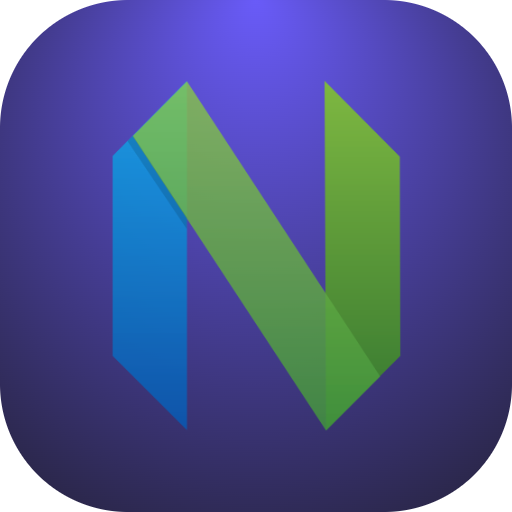

<p align="center">
  
</p>

<h1 align="center">Neovim Expert for Raycast</h1>

<p align="center">Ask questions about your Neovim configuration using Raycast AI.</p>

Type `@neovim-expert` in Raycast AI Chat to search plugins, keybindings, LSP setup, and more.

## Setup

The extension auto-detects your Neovim config at `~/.config/nvim`. To use a custom path, set it in Raycast Settings > Extensions > Neovim Expert > Neovim Config Directory.

## Tools

| Tool | Description |
|------|-------------|
| Get Config Summary | Overview of your config: plugin manager, key files, structure |
| List Config Files | Browse the file tree of your config directory |
| Read Config File | Read a specific configuration file |
| List Plugins | List all installed plugins (lazy.nvim, packer, vim-plug) |
| Search Config | Search across all config files for a term |
| Search Keybindings | Find keybinding definitions |

## Examples

- "What plugins do I have?"
- "What does leader-f do?"
- "Show me my Go LSP config"
- "What formatter do I use for YAML?"
- "How is completion set up?"

## Development

```bash
npm install --legacy-peer-deps
npm test                          # Run tests
npm test -- --coverage            # Run with coverage (95% threshold enforced)
npm run dev                       # Start Raycast dev mode
```

After cloning, configure the pre-push hook:

```bash
git config core.hooksPath .githooks
```
